# Shaper Architecture Documentation

**Version:** v1alpha1
**Last Updated:** 2025-11-02
**Total Lines of Code:** ~4,541 (excluding tests and generated code)
**Test Files:** 31
**Go Version:** 1.24.1

## Table of Contents

- [1. System Overview](#1-system-overview)
- [2. Component Architecture Diagram](#2-component-architecture-diagram)
- [3. Detailed Component Breakdown](#3-detailed-component-breakdown)
- [4. Data Flow Diagrams](#4-data-flow-diagrams)
- [5. Dependency Graph](#5-dependency-graph)
- [6. Implementation Status Matrix](#6-implementation-status-matrix)
- [7. Technology Stack Diagram](#7-technology-stack-diagram)
- [8. Architectural Patterns & Principles](#8-architectural-patterns--principles)
- [9. Critical Paths & Bottlenecks](#9-critical-paths--bottlenecks)
- [10. Future Architecture Considerations](#10-future-architecture-considerations)
- [11. Testing Strategy Overview](#11-testing-strategy-overview)

---

## 1. System Overview

### Purpose

**Shaper** is a Kubernetes-native iPXE boot server that provides fine-grained server configuration management and assignment. It enables automated network booting of bare-metal servers by:

- Serving iPXE boot scripts dynamically based on machine attributes
- Managing boot profiles with Kubernetes Custom Resources (CRDs)
- Assigning configurations to machines based on label selectors
- Supporting multiple configuration sources (inline, Kubernetes objects, webhooks)
- Transforming configurations (e.g., Butane to Ignition)

### Key Architectural Decisions

1. **Kubernetes-Native Design**: Uses CRDs (Profile, Assignment) as the storage backend, leveraging etcd instead of external databases
2. **Separation of Concerns**: Clear boundaries between adapters (data access), controllers (business logic), and drivers (HTTP/webhook handlers)
3. **Interface-Driven Architecture**: Heavy use of Go interfaces for dependency injection and testability
4. **Stateless API Server**: REST API servers are stateless, querying Kubernetes API for configuration
5. **Template-Based Configuration**: iPXE scripts use Go templates for dynamic content injection
6. **Pluggable Resolvers and Transformers**: Multiple content sources and transformation pipelines

### System Architecture Style

- **Layered Architecture** with clear separation:
  - **Driver Layer**: HTTP handlers and external interfaces
  - **Controller Layer**: Business logic and orchestration
  - **Adapter Layer**: Data access and external service integration
  - **Types Layer**: Domain models
- **Monolithic Deployment** with potential for future microservices (separate webhook and controller components)

### Technology Stack Overview

- **Language**: Go 1.23.5
- **Kubernetes Tooling**: controller-runtime v0.18.2, client-go v0.30.1
- **HTTP Server**: Native `net/http` with OpenAPI-generated handlers (oapi-codegen)
- **Configuration Transformation**: CoreOS Butane v0.19.0 (Butane → Ignition)
- **Monitoring**: Prometheus client v1.18.0
- **Testing**: testify v1.9.0
- **Code Generation**: oapi-codegen (OpenAPI), controller-gen (CRDs), mockery (mocks)

---

## 2. Component Architecture Diagram


**Legend:**
- [DONE] - Fully Implemented with Tests
- [PARTIAL] - Partially Implemented or Missing Tests
- [TODO] - Not Yet Implemented (Placeholder)

**Color Coding:**
- Green - Fully implemented
- Yellow - Partially implemented
- Red - Not implemented

---

## 3. Detailed Component Breakdown

### 3.1 Binaries (cmd/)

#### shaper-api
- **Status**: Fully Implemented ✅
- **Test Coverage**: Partial Integration Tests ⚠️
- **Purpose**: Main HTTP server that serves iPXE boot scripts and configuration files
- **Key Files**:
  - `cmd/shaper-api/main.go:1-267`
- **Key Packages**:
  - `github.com/alexandremahdhaoui/shaper/pkg/generated/shaperserver` (OpenAPI generated)
  - `github.com/prometheus/client_golang/prometheus/promhttp`
  - `sigs.k8s.io/controller-runtime/pkg/client`
- **Implementation Notes**:
  - Runs 3 HTTP servers: API (iPXE), Metrics (Prometheus), Probes (health checks)
  - Configuration via JSON file specified by `IPXER_CONFIG_PATH` environment variable
  - Supports in-cluster and external kubeconfig
  - 93 TODOs in codebase (includes "TODO: wrap err", missing features)
  - Graceful shutdown implemented via `internal/util/gracefulshutdown`

#### shaper-controller
- **Status**: Not Implemented ❌
- **Test Coverage**: N/A
- **Purpose**: Future Kubernetes controller for reconciliation loops
- **Key Files**:
  - `cmd/shaper-controller/main.go:1-40`
- **Implementation Notes**:
  - Placeholder only - panics with "implement me"
  - Intended for maintaining internal state and reconciling CRD changes
  - Not required for current MVP functionality

#### shaper-webhook
- **Status**: Not Implemented ❌
- **Test Coverage**: N/A
- **Purpose**: Kubernetes admission webhooks for validation and mutation of Profile/Assignment CRDs
- **Key Files**:
  - `cmd/shaper-webhook/main.go:1-40`
- **Implementation Notes**:
  - Placeholder only - panics with "implement me"
  - Webhook drivers exist in `internal/driver/webhook` but not integrated

#### shaper-tftp
- **Status**: Not Implemented ❌
- **Test Coverage**: N/A
- **Purpose**: TFTP server for initial iPXE chainloading
- **Key Files**:
  - `cmd/shaper-tftp/README.md` (reference only)
- **Implementation Notes**:
  - Not yet implemented
  - TFTP is mentioned as deployment option but no code exists

---

### 3.2 Driver Layer (internal/driver/)

#### HTTP Server Driver
- **Status**: Fully Implemented ✅
- **Test Coverage**: Missing Tests ⚠️
- **Purpose**: Implements OpenAPI-generated HTTP server interface for iPXE endpoints
- **Dependencies**: Controller layer (IPXE, Content)
- **Dependents**: shaper-api binary
- **Key Files**:
  - `internal/driver/server/server.go:1-120`
- **Key Interfaces Implemented**:
  - `shaperserver.StrictServerInterface`
- **Implementation Notes**:
  - Handles `/boot.ipxe` (bootstrap chainload)
  - Handles `/ipxe` (profile selection and rendering)
  - Handles `/config/{uuid}` (content retrieval)
  - No unit tests present (`*_test.go` files missing)

#### Webhook Driver
- **Status**: Partially Implemented 🚧
- **Test Coverage**: Has Unit Tests ✅
- **Purpose**: Validation and mutation logic for Profile and Assignment webhooks
- **Dependencies**: Types layer
- **Dependents**: shaper-webhook binary (not yet implemented)
- **Key Files**:
  - `internal/driver/webhook/assignment.go:1-150`
  - `internal/driver/webhook/profile.go:1-180`
  - `internal/driver/webhook/types.go:1-80`
  - `internal/driver/webhook/assignment_test.go:1-200`
  - `internal/driver/webhook/profile_test.go:1-150`
- **Implementation Notes**:
  - Validation logic exists but not integrated into running webhook server
  - Tests verify validation rules for CRDs
  - Needs integration with admission webhook framework

---

### 3.3 Controller Layer (internal/controller/)

#### IPXE Controller
- **Status**: Fully Implemented ✅
- **Test Coverage**: Has Unit Tests ✅
- **Purpose**: Orchestrates assignment selection and profile rendering for iPXE requests
- **Dependencies**: Assignment Adapter, Profile Adapter, ResolveTransformerMux
- **Dependents**: HTTP Server Driver
- **Key Files**:
  - `internal/controller/ipxe.go:1-200`
  - `internal/controller/ipxe_test.go:1-300`
- **Key Interfaces**:
  ```go
  type IPXE interface {
      FindProfileAndRender(ctx context.Context, selectors types.IPXESelectors) ([]byte, error)
      Boostrap() []byte
  }
  ```
- **Implementation Notes**:
  - Implements fallback logic: specific assignment → default assignment
  - Caches bootstrap script for performance
  - Uses Go templates for iPXE script rendering
  - Comprehensive error wrapping with `errors.Join`

#### Content Controller
- **Status**: Fully Implemented ✅
- **Test Coverage**: Has Unit Tests ✅
- **Purpose**: Retrieves and renders additional configuration files by UUID
- **Dependencies**: Profile Adapter, ResolveTransformerMux
- **Dependents**: HTTP Server Driver
- **Key Files**:
  - `internal/controller/content.go:1-120`
  - `internal/controller/content_test.go:1-200`
- **Key Interfaces**:
  ```go
  type Content interface {
      GetByID(ctx context.Context, contentID uuid.UUID, attributes types.IPXESelectors) ([]byte, error)
  }
  ```
- **Implementation Notes**:
  - Looks up content by UUID from Profile CRD status
  - Applies resolver and transformer pipeline
  - Validates UUID is not nil

#### ResolveTransformerMux
- **Status**: Fully Implemented ✅
- **Test Coverage**: Has Unit Tests ✅
- **Purpose**: Orchestrates content resolution and transformation pipeline
- **Dependencies**: Resolver interfaces, Transformer interfaces
- **Dependents**: IPXE Controller, Content Controller
- **Key Files**:
  - `internal/controller/resolvetransformermux.go:1-250`
  - `internal/controller/resolvetransformermux_test.go:1-350`
- **Key Interfaces**:
  ```go
  type ResolveTransformerMux interface {
      ResolveAndTransform(ctx context.Context, content types.Content, selectors types.IPXESelectors) ([]byte, error)
      ResolveAndTransformBatch(ctx context.Context, contents map[string]types.Content, selectors types.IPXESelectors, opts ...ResolveTransformBatchOption) (map[string][]byte, error)
  }
  ```
- **Implementation Notes**:
  - Routes to appropriate resolver (Inline, ObjectRef, Webhook)
  - Chains multiple transformers (e.g., Butane → Ignition)
  - Batch processing for multiple contents
  - Go template rendering with content substitution

---

### 3.4 Adapter Layer (internal/adapter/)

#### Assignment Adapter
- **Status**: Fully Implemented ✅
- **Test Coverage**: Has Unit Tests ✅
- **Purpose**: Queries Assignment CRDs to find which profile to use for a booting machine
- **Dependencies**: Kubernetes client, v1alpha1 types
- **Dependents**: IPXE Controller
- **Key Files**:
  - `internal/adapter/assignment.go:1-180`
  - `internal/adapter/assignment_test.go:1-200`
- **Key Interfaces**:
  ```go
  type Assignment interface {
      FindDefaultByBuildarch(ctx context.Context, buildarch string) (types.Assignment, error)
      FindBySelectors(ctx context.Context, selectors types.IPXESelectors) (types.Assignment, error)
  }
  ```
- **Implementation Notes**:
  - Uses label selectors for assignment matching
  - Supports UUID and buildarch-based selection
  - Returns `ErrAssignmentNotFound` when no match

#### Profile Adapter
- **Status**: Fully Implemented ✅
- **Test Coverage**: Has Unit Tests ✅
- **Purpose**: Retrieves Profile CRDs and converts to internal domain types
- **Dependencies**: Kubernetes client, v1alpha1 types
- **Dependents**: IPXE Controller, Content Controller
- **Key Files**:
  - `internal/adapter/profile.go:1-280`
  - `internal/adapter/profile_test.go:1-150`
- **Key Interfaces**:
  ```go
  type Profile interface {
      GetByNamespacedName(ctx context.Context, namespace, name string) (types.Profile, error)
      ListByContentID(ctx context.Context, contentID uuid.UUID) ([]types.Profile, error)
  }
  ```
- **Implementation Notes**:
  - Converts CRD spec to internal types with proper error handling
  - Parses and validates JSONPath expressions for ObjectRef
  - Builds content ID to name mappings

#### Resolvers
- **Status**: Fully Implemented ✅
- **Test Coverage**: Has Unit Tests ✅
- **Purpose**: Resolve content from various sources (inline, Kubernetes objects, webhooks)
- **Dependencies**: Kubernetes dynamic client, HTTP client
- **Dependents**: ResolveTransformerMux
- **Key Files**:
  - `internal/adapter/resolver.go:1-350`
  - `internal/adapter/resolver_test.go:1-400`
- **Key Interfaces**:
  ```go
  type Resolver interface {
      Resolve(ctx context.Context, content types.Content, attributes types.IPXESelectors) ([]byte, error)
  }
  type ObjectRefResolver interface {
      Resolver
      ResolvePaths(ctx context.Context, paths []*jsonpath.JSONPath, ref types.ObjectRef) ([][]byte, error)
  }
  ```
- **Implementations**:
  - **InlineResolver**: Returns content directly from spec
  - **ObjectRefResolver**: Fetches from Kubernetes objects using JSONPath
  - **WebhookResolver**: Calls external HTTP endpoints with mTLS support
- **Implementation Notes**:
  - WebhookResolver supports mTLS with cert references
  - ObjectRefResolver uses dynamic client for arbitrary GVR
  - Comprehensive error wrapping

#### Transformers
- **Status**: Fully Implemented ✅
- **Test Coverage**: Has Unit Tests ✅
- **Purpose**: Transform content (e.g., Butane YAML to Ignition JSON)
- **Dependencies**: CoreOS Butane library, HTTP client
- **Dependents**: ResolveTransformerMux
- **Key Files**:
  - `internal/adapter/transformer.go:1-220`
  - `internal/adapter/transformer_test.go:1-280`
- **Key Interfaces**:
  ```go
  type Transformer interface {
      Transform(ctx context.Context, cfg types.TransformerConfig, content []byte, selectors types.IPXESelectors) ([]byte, error)
  }
  ```
- **Implementations**:
  - **ButaneTransformer**: Converts Butane config to Ignition (CoreOS)
  - **WebhookTransformer**: Calls external transformation webhooks
- **Implementation Notes**:
  - ButaneTransformer uses `github.com/coreos/butane` library
  - WebhookTransformer supports mTLS and basic auth
  - POST request body is the content to transform

---

### 3.5 Types Layer

#### Internal Types
- **Status**: Fully Implemented ✅
- **Test Coverage**: N/A (no logic to test)
- **Purpose**: Domain models used throughout internal packages
- **Dependencies**: uuid, jsonpath libraries
- **Dependents**: All internal packages
- **Key Files**:
  - `internal/types/types.profile.go:1-150`
  - `internal/types/types.assignment.go:1-80`
  - `internal/types/types.ipxe.go:1-100`
- **Key Types**:
  - `Profile`: Internal representation of iPXE profile
  - `Assignment`: Internal assignment model
  - `Content`: Content with resolver/transformer config
  - `IPXESelectors`: Machine attributes (UUID, buildarch, labels)
  - `ResolverKind`, `TransformerKind`: Enum types
- **Implementation Notes**:
  - Clean separation from Kubernetes API types
  - Adapters convert v1alpha1 CRDs → internal types

#### CRD Types (pkg/v1alpha1)
- **Status**: Fully Implemented ✅
- **Test Coverage**: N/A (generated code)
- **Purpose**: Kubernetes Custom Resource Definitions
- **Dependencies**: k8s.io/apimachinery
- **Dependents**: Adapters, Kubernetes API server
- **Key Files**:
  - `pkg/v1alpha1/types.profile.go:1-200`
  - `pkg/v1alpha1/types.assignment.go:1-150`
  - `pkg/v1alpha1/gv.go:1-80`
  - `pkg/v1alpha1/zz_generated.deepcopy.go` (auto-generated)
- **Key Types**:
  - `Profile`: iPXE template + additional content specs
  - `Assignment`: Subject selectors → Profile selectors
  - `AdditionalContent`: Content sources and transformers
- **Implementation Notes**:
  - Generated DeepCopy methods via controller-gen
  - Kubebuilder markers for CRD generation
  - API version: `shaper.amahdha.com/v1alpha1`

---

### 3.6 Utility Packages (internal/util/)

#### Graceful Shutdown
- **Status**: Fully Implemented ✅
- **Test Coverage**: Missing Tests ⚠️
- **Purpose**: Coordinates graceful shutdown across multiple HTTP servers
- **Key Files**:
  - `internal/util/gracefulshutdown/gracefulshutdown.go:1-150`

#### HTTP Util
- **Status**: Fully Implemented ✅
- **Test Coverage**: Missing Tests ⚠️
- **Purpose**: Helper functions for serving multiple HTTP servers
- **Key Files**:
  - `internal/util/httputil/serve.go:1-120`
  - `internal/util/httputil/httputil.go:1-80`

#### Cert Util
- **Status**: Fully Implemented ✅
- **Test Coverage**: Missing Tests ⚠️
- **Purpose**: Certificate and TLS configuration helpers
- **Key Files**:
  - `internal/util/certutil/certutil.go:1-150`

#### Test Util
- **Status**: Fully Implemented ✅
- **Test Coverage**: N/A
- **Purpose**: Test fixtures and helpers
- **Key Files**:
  - `internal/util/testutil/assets.go:1-80`

#### Fakes & Mocks
- **Status**: Fully Implemented ✅
- **Test Coverage**: N/A (test support)
- **Purpose**: Test doubles for adapters and controllers
- **Key Files**:
  - `internal/util/fakes/` (manual fakes)
  - `internal/util/mocks/` (mockery-generated)
- **Implementation Notes**:
  - Mocks generated via mockery for interfaces
  - Fakes for complex test scenarios

---

### 3.7 Generated Code (pkg/generated/)

#### OpenAPI Clients & Servers
- **Status**: Auto-Generated ✅
- **Test Coverage**: N/A
- **Purpose**: HTTP client and server stubs from OpenAPI specs
- **Dependencies**: oapi-codegen/runtime
- **Key Files**:
  - `pkg/generated/shaperserver/zz_generated.oapi-codegen.go` (iPXE API server)
  - `pkg/generated/shaperclient/zz_generated.oapi-codegen.go` (iPXE API client)
  - `pkg/generated/resolverserver/zz_generated.oapi-codegen.go` (Webhook resolver server)
  - `pkg/generated/resolverclient/zz_generated.oapi-codegen.go` (Webhook resolver client)
  - `pkg/generated/transformerserver/zz_generated.oapi-codegen.go` (Webhook transformer server)
  - `pkg/generated/transformerclient/zz_generated.oapi-codegen.go` (Webhook transformer client)
- **Source Specs**:
  - `api/shaper.v1.yaml` (main iPXE API)
  - `api/shaper-webhook-resolver.v1.yaml`
  - `api/shaper-webhook-transformer.v1.yaml`

---

## 4. Data Flow Diagrams

### 4.1 iPXE Boot Flow

```mermaid
sequenceDiagram
    actor Machine as Booting Machine
    participant DHCP as DHCP Server
    participant API as shaper-api
    participant Server as Server Driver
    participant IPXE as IPXE Controller
    participant Assignment as Assignment Adapter
    participant Profile as Profile Adapter
    participant Mux as ResolveTransformerMux
    participant K8s as Kubernetes API

    Note over Machine: Machine powers on
    Machine->>DHCP: DHCP Request
    DHCP-->>Machine: DHCP Response<br/>(next-server = shaper-api)

    Note over Machine: Phase [BOOTSTRAPPING]
    Machine->>API: GET /boot.ipxe
    API->>Server: GetBootIPXE()
    Server->>IPXE: Boostrap()
    IPXE-->>Server: Cached bootstrap script<br/>#!ipxe<br/>dhcp<br/>chain /ipxe?uuid=${uuid}&buildarch=${buildarch}
    Server-->>API: Bootstrap script
    API-->>Machine: iPXE script

    Note over Machine: Phase [ASSIGNMENT]<br/>Machine executes bootstrap<br/>and chainloads /ipxe
    Machine->>API: GET /ipxe?uuid=XXX&buildarch=amd64
    API->>Server: GetIPXE(uuid, buildarch, labels...)
    Server->>IPXE: FindProfileAndRender(selectors)

    IPXE->>Assignment: FindBySelectors(uuid, buildarch)
    Assignment->>K8s: List Assignments<br/>(label selectors)
    K8s-->>Assignment: Assignment list

    alt Assignment found
        Assignment-->>IPXE: Assignment with Profile reference
    else No specific assignment
        IPXE->>Assignment: FindDefaultByBuildarch(amd64)
        Assignment->>K8s: List Assignments<br/>(default=true, buildarch=amd64)
        K8s-->>Assignment: Default assignment
        Assignment-->>IPXE: Default assignment
    end

    IPXE->>Profile: GetByNamespacedName(namespace, name)
    Profile->>K8s: Get Profile CRD
    K8s-->>Profile: Profile resource
    Profile-->>IPXE: Internal Profile type

    IPXE->>Mux: ResolveAndTransformBatch(contents, selectors)

    loop For each AdditionalContent
        Mux->>Mux: Select Resolver<br/>(Inline/ObjectRef/Webhook)

        alt Inline Content
            Note over Mux: Use content directly
        else ObjectRef
            Mux->>K8s: Get ConfigMap/Secret<br/>Apply JSONPath
        else Webhook
            Mux->>Mux: Call external webhook
        end

        Mux->>Mux: Apply Transformers<br/>(e.g., Butane→Ignition)
        Mux->>Mux: Store resolved content
    end

    Mux-->>IPXE: Map of resolved contents

    IPXE->>IPXE: Render Go template<br/>Substitute {{ .AdditionalContent.X }}
    IPXE-->>Server: Rendered iPXE script<br/>(may contain /config/{uuid} URLs)
    Server-->>API: iPXE script
    API-->>Machine: Final iPXE script

    Note over Machine: Phase [BOOT]<br/>Machine executes iPXE commands

    alt Script references /config/{uuid}
        Note over Machine: Phase [OPTIONAL]<br/>Fetch additional config
        Machine->>API: GET /config/{uuid}?buildarch=amd64
        API->>Server: GetConfig(uuid, selectors)
        Server->>Content: GetByID(uuid, selectors)
        Content->>Profile: ListByContentID(uuid)
        Profile->>K8s: List Profiles<br/>(by content UUID)
        K8s-->>Profile: Profile with matching content
        Profile-->>Content: Profile
        Content->>Mux: ResolveAndTransform(content, selectors)
        Mux-->>Content: Rendered config
        Content-->>Server: Config bytes
        Server-->>API: Config
        API-->>Machine: Configuration file<br/>(Ignition, Cloud-Init, etc.)
    end

    Note over Machine: Machine boots OS

    Note over IPXE: ✅ Fully implemented
    Note over Assignment: ✅ Fully implemented with tests
    Note over Profile: ✅ Fully implemented with tests
    Note over Mux: ✅ Fully implemented with tests
```



### 4.2 Profile Creation & Validation Flow

```mermaid
sequenceDiagram
    actor Operator
    participant Kubectl as kubectl
    participant K8sAPI as Kubernetes API
    participant Webhook as shaper-webhook<br/>(Not Implemented ❌)
    participant WHDriver as Webhook Driver<br/>(Code exists 🚧)
    participant ETCD as etcd

    Operator->>Kubectl: kubectl apply -f profile.yaml
    Kubectl->>K8sAPI: Create Profile

    K8sAPI->>Webhook: Admission Request
    Note over Webhook: ❌ Not running yet

    rect rgb(255, 240, 200)
        Note over WHDriver: 🚧 Validation logic exists<br/>but not integrated
        Webhook->>WHDriver: Validate Profile
        WHDriver->>WHDriver: Check required fields<br/>Validate content sources<br/>Check transformer configs

        alt Valid
            WHDriver-->>Webhook: Admit
            Webhook-->>K8sAPI: Allowed
        else Invalid
            WHDriver-->>Webhook: Reject with reason
            Webhook-->>K8sAPI: Denied
            K8sAPI-->>Kubectl: Error message
            Kubectl-->>Operator: Validation error
        end
    end

    K8sAPI->>ETCD: Store Profile
    ETCD-->>K8sAPI: Stored

    K8sAPI->>K8sAPI: Generate UUIDs for<br/>exposed content
    K8sAPI->>ETCD: Update Profile status

    K8sAPI-->>Kubectl: Success
    Kubectl-->>Operator: Profile created

    Note over Webhook: ❌ TODO: Implement webhook server
    Note over WHDriver: 🚧 Validation code ready,<br/>needs integration
```



### 4.3 Error Handling Flow


---

## 5. Dependency Graph

### 5.1 Internal Package Dependencies


### 5.2 External Dependencies (go.mod)

#### Direct Dependencies

| Package | Version | Purpose | Usage |
|---------|---------|---------|-------|
| `github.com/coreos/butane` | v0.19.0 | Butane→Ignition transformer | Transforms Fedora CoreOS configs |
| `github.com/getkin/kin-openapi` | v0.123.0 | OpenAPI validation | Used by oapi-codegen |
| `github.com/google/uuid` | v1.6.0 | UUID generation | Content IDs, machine UUIDs |
| `github.com/oapi-codegen/runtime` | v1.1.1 | OpenAPI runtime | HTTP handler support |
| `github.com/prometheus/client_golang` | v1.18.0 | Metrics | Prometheus metrics endpoint |
| `github.com/stretchr/testify` | v1.9.0 | Testing | Assertions and mocking |
| `k8s.io/api` | v0.30.1 | Kubernetes API types | Core types (ConfigMap, Secret) |
| `k8s.io/apimachinery` | v0.30.1 | Kubernetes machinery | metav1, runtime, etc. |
| `k8s.io/client-go` | v0.30.1 | Kubernetes client | API client, dynamic client |
| `k8s.io/utils` | v0.0.0 | Kubernetes utilities | JSONPath parsing |
| `sigs.k8s.io/controller-runtime` | v0.18.2 | Controller framework | Client, scheme, manager |

#### Key Indirect Dependencies

- `github.com/coreos/ignition/v2` v2.16.2 (via butane)
- `github.com/go-logr/logr` v1.4.1 (logging interface for controller-runtime)
- `golang.org/x/net` v0.26.0 (HTTP/2 support)
- `google.golang.org/protobuf` v1.34.1 (Kubernetes uses protobuf)

#### No Replace Directives

The `go.mod` has no `replace` directives, indicating standard upstream dependencies.

---

## 6. Implementation Status Matrix

### 6.1 Package-Level Status

| Package/Component | Implementation | Unit Tests | Integration Tests | Benchmarks | Test Coverage Est. | Notes |
|-------------------|----------------|------------|-------------------|------------|-------------------|-------|
| **Binaries** |
| cmd/shaper-api | ✅ Complete | ⚠️ Partial | ⚠️ Partial | ❌ No | ~60% | Manual testing in e2e, startup untested |
| cmd/shaper-controller | ❌ Not Started | ❌ No | ❌ No | ❌ No | 0% | Placeholder only, panics |
| cmd/shaper-webhook | ❌ Not Started | ❌ No | ❌ No | ❌ No | 0% | Placeholder only, panics |
| cmd/shaper-tftp | ❌ Not Started | ❌ No | ❌ No | ❌ No | 0% | Not implemented |
| **Driver Layer** |
| internal/driver/server | ✅ Complete | ❌ No | ⚠️ Partial | ❌ No | ~40% | Only e2e tests, no unit tests |
| internal/driver/webhook | 🚧 Partial | ✅ Yes | ❌ No | ❌ No | ~70% | Logic done, not integrated |
| **Controller Layer** |
| internal/controller/ipxe | ✅ Complete | ✅ Yes | ⚠️ Partial | ❌ No | ~75% | Good test coverage |
| internal/controller/content | ✅ Complete | ✅ Yes | ⚠️ Partial | ❌ No | ~75% | Good test coverage |
| internal/controller/mux | ✅ Complete | ✅ Yes | ⚠️ Partial | ❌ No | ~70% | Complex logic well-tested |
| **Adapter Layer** |
| internal/adapter/assignment | ✅ Complete | ✅ Yes | ⚠️ Partial | ❌ No | ~75% | Table-driven tests present |
| internal/adapter/profile | ✅ Complete | ✅ Yes | ⚠️ Partial | ❌ No | ~70% | Complex parsing tested |
| internal/adapter/resolver | ✅ Complete | ✅ Yes | ⚠️ Partial | ❌ No | ~65% | Webhook resolution untested |
| internal/adapter/transformer | ✅ Complete | ✅ Yes | ⚠️ Partial | ❌ No | ~70% | Butane tested, webhook partial |
| **Types & Models** |
| internal/types | ✅ Complete | N/A | N/A | N/A | N/A | No logic to test |
| pkg/v1alpha1 | ✅ Complete | N/A | N/A | N/A | N/A | Generated deepcopy |
| pkg/constants | ✅ Complete | N/A | N/A | N/A | N/A | Constants only |
| **Utilities** |
| internal/util/gracefulshutdown | ✅ Complete | ⚠️ Partial | ❌ No | ❌ No | ~30% | Manual testing only |
| internal/util/httputil | ✅ Complete | ❌ No | ❌ No | ❌ No | 0% | No tests |
| internal/util/certutil | ✅ Complete | ❌ No | ❌ No | ❌ No | 0% | No tests |
| internal/util/testutil | ✅ Complete | N/A | N/A | N/A | N/A | Test support code |
| internal/util/fakes | ✅ Complete | N/A | N/A | N/A | N/A | Test support code |
| internal/util/mocks | ✅ Complete | N/A | N/A | N/A | N/A | Generated mocks |
| **Generated Code** |
| pkg/generated/* | ✅ Complete | N/A | N/A | N/A | N/A | Auto-generated |

### 6.2 Test Coverage Statistics

**Note**: These are estimates based on file analysis. Run `go test -cover ./...` for actual coverage.

- **Overall estimated test coverage**: ~55-60%
- **Packages with 70%+ coverage**: 7/15 testable packages
- **Packages with no tests**: 5/15 testable packages
  - `internal/driver/server` ⚠️ **Critical gap**
  - `internal/util/httputil` ⚠️ **Should be tested**
  - `internal/util/certutil` ⚠️ **Should be tested**
  - `internal/util/gracefulshutdown` ⚠️ **Should be tested**
  - `cmd/shaper-api` ⚠️ **Integration tests exist, unit tests missing**

- **Packages missing benchmarks**: All (0 benchmark tests found)

### 6.3 Critical Testing Gaps

1. **HTTP Server Driver** (`internal/driver/server`):
   - ❌ No unit tests
   - ⚠️ Only tested via manual e2e
   - 🎯 **High Priority**: Should test HTTP handlers with `httptest`

2. **Graceful Shutdown** (`internal/util/gracefulshutdown`):
   - ❌ No automated tests
   - ⚠️ Critical for production stability
   - 🎯 **High Priority**: Test shutdown coordination

3. **Cert/TLS Utilities** (`internal/util/certutil`):
   - ❌ No tests
   - ⚠️ Security-critical code
   - 🎯 **Medium Priority**: Test certificate validation

4. **Webhook Resolution/Transformation**:
   - ⚠️ Partial test coverage
   - 🎯 **Medium Priority**: Test mTLS, error cases

5. **End-to-End Scenarios**:
   - ⚠️ Limited e2e tests (manual test in `test/e2e/main.sh`)
   - 🎯 **Medium Priority**: Automated e2e test suite

### 6.4 TODOs in Codebase

Total TODOs found: **93**

Common patterns:
- `// TODO: wrap err` (error handling improvements)
- `// TODO: implement me` (placeholders)
- `// TODO: set fields etc...` (incomplete struct initialization)
- OAuth integration pending (mentioned in README)
- Password reset flow incomplete (not found in code)

---

## 7. Technology Stack Diagram


### Technology Stack Breakdown

#### **Frontend** (iPXE Clients)
- iPXE network boot firmware
- Chainloading iPXE scripts

#### **Backend** (Go 1.23.5)
- **HTTP Framework**: Native `net/http` (no external web framework)
- **OpenAPI**: `oapi-codegen` v1.1.1 for code generation
- **Kubernetes Client**: `controller-runtime` v0.18.2, `client-go` v0.30.1
- **Configuration**: JSON-based config files
- **Error Handling**: `errors.Join` for error chains (Go 1.20+)
- **Concurrency**: Standard goroutines and channels (graceful shutdown coordination)

#### **Data & Storage**
- **Primary Store**: Kubernetes etcd via Custom Resources
- **CRD API Version**: `shaper.amahdha.com/v1alpha1`
- **Secondary Sources**: ConfigMaps, Secrets (via ObjectRef)
- **No External Database**: Design decision to avoid operational complexity

#### **Content Transformation**
- **Butane**: `github.com/coreos/butane` v0.19.0 (Butane YAML → Ignition JSON)
- **Go Templates**: `text/template` for iPXE script rendering
- **JSONPath**: `k8s.io/client-go/util/jsonpath` for object traversal

#### **Observability**
- **Metrics**: Prometheus `client_golang` v1.18.0
- **Logging**: Standard library `log/slog` (structured logging)
- **Health Checks**: Custom HTTP probes on separate port

#### **Testing**
- **Framework**: `github.com/stretchr/testify` v1.9.0
- **Mocking**: `mockery` for interface mocks
- **HTTP Testing**: `net/http/httptest` (not currently used extensively)

#### **Infrastructure**
- **Containers**: Containerfiles present in `containers/`
- **Helm Charts**: Helm chart in `charts/shaper/`
- **CI/CD**: GitHub Actions workflows in `.github/workflows/`
  - `lint.yml`
  - `pr-dependabot.yaml`
- **Kubernetes**: Designed for in-cluster deployment

---

## 8. Architectural Patterns & Principles

### 8.1 Go-Specific Patterns

#### Interface-Based Design
```go
// Example: Resolver interface with multiple implementations
type Resolver interface {
    Resolve(ctx context.Context, content types.Content, attributes types.IPXESelectors) ([]byte, error)
}

// Implementations: InlineResolver, ObjectRefResolver, WebhookResolver
```
- **Usage**: Extensive throughout adapters and controllers
- **Benefits**: Easy testing with mocks, pluggable implementations

#### Constructor Functions (New* Pattern)
```go
func NewAssignment(c client.Client, namespace string) Assignment
func NewIPXE(assignment adapter.Assignment, profile adapter.Profile, mux ResolveTransformerMux) IPXE
```
- **Usage**: Every component has a constructor
- **Benefits**: Clear initialization, dependency injection

#### Functional Options Pattern
```go
type ResolveTransformBatchOption func(*resolveTransformBatchConfig)

func WithRenderOption(render bool) ResolveTransformBatchOption {
    return func(cfg *resolveTransformBatchConfig) {
        cfg.render = render
    }
}
```
- **Usage**: In `ResolveTransformerMux.ResolveAndTransformBatch`
- **Benefits**: Optional parameters, backwards compatibility

#### Context Propagation
- **Usage**: Every I/O operation accepts `context.Context`
- **Benefits**: Cancellation, timeouts, request-scoped values
- **Example**: `FindProfileAndRender(ctx context.Context, selectors types.IPXESelectors) ([]byte, error)`

#### Error Wrapping (errors.Join)
```go
return errors.Join(
    err,
    errAssignmentList,
    errAssignmentFindDefault,
)
```
- **Usage**: Comprehensive error wrapping throughout
- **Benefits**: Error chain inspection with `errors.Is`, `errors.As`
- **Note**: Uses Go 1.20+ `errors.Join` for multiple error wrapping

### 8.2 Architectural Style

**Layered Architecture with Clean Architecture Influences**

```
┌─────────────────────────────────────────────────────────┐
│  Driver Layer (HTTP Handlers, External Interfaces)      │
│  - internal/driver/server                                │
│  - internal/driver/webhook                               │
└─────────────────────────────────────────────────────────┘
                         ↓
┌─────────────────────────────────────────────────────────┐
│  Controller Layer (Business Logic, Orchestration)       │
│  - internal/controller/ipxe                              │
│  - internal/controller/content                           │
│  - internal/controller/resolvetransformermux             │
└─────────────────────────────────────────────────────────┘
                         ↓
┌─────────────────────────────────────────────────────────┐
│  Adapter Layer (Data Access, External Services)         │
│  - internal/adapter/assignment (K8s CRD access)          │
│  - internal/adapter/profile (K8s CRD access)             │
│  - internal/adapter/resolver (content sources)           │
│  - internal/adapter/transformer (content transform)      │
└─────────────────────────────────────────────────────────┘
                         ↓
┌─────────────────────────────────────────────────────────┐
│  Domain Models (Types)                                   │
│  - internal/types (domain types)                         │
│  - pkg/v1alpha1 (Kubernetes API types)                   │
└─────────────────────────────────────────────────────────┘
```

**Key Principles:**
- **Dependency Rule**: Dependencies point inward (driver → controller → adapter → types)
- **Interface Boundaries**: Each layer defines interfaces for the layer below
- **Testability**: Interfaces allow mocking at every boundary

### 8.3 Code Organization Strategy

#### Package Structure
```
shaper/
├── cmd/                      # Binary entry points (main packages)
├── internal/                 # Private application code
│   ├── adapter/             # Data access layer (K8s, webhooks)
│   ├── controller/          # Business logic layer
│   ├── driver/              # External interface layer (HTTP, webhooks)
│   ├── types/               # Domain models (internal representation)
│   └── util/                # Shared utilities
├── pkg/                      # Public library code (importable by other projects)
│   ├── v1alpha1/            # Kubernetes CRD types
│   ├── generated/           # OpenAPI generated code
│   └── constants/           # Shared constants
├── api/                      # OpenAPI specifications
├── charts/                   # Helm charts
└── test/                     # Integration tests
```

**Visibility Strategy:**
- `internal/`: Not importable by external projects (Go enforced)
- `pkg/`: Public API, stable and documented
- Adapters know about CRD types (`pkg/v1alpha1`)
- Controllers use internal types (`internal/types`)
- Adapters convert between CRD types and internal types

### 8.4 Concurrency Patterns

#### Goroutine Usage
```go
// Example: Serving multiple HTTP servers concurrently
for name, srv := range servers {
    go func(name string, server *http.Server) {
        if err := server.ListenAndServe(); err != nil && !errors.Is(err, http.ErrServerClosed) {
            slog.ErrorContext(ctx, "server error", "server", name, "error", err)
        }
    }(name, srv)
}
```
- **Usage**: HTTP server startup, graceful shutdown coordination
- **Pattern**: Launch goroutines with properly captured loop variables

#### Synchronization Primitives
- **Channels**: Used in graceful shutdown coordination
- **WaitGroups**: Not prominently used (could be added for shutdown)
- **Mutexes**: Not heavily used (mostly stateless components)

#### No Worker Pools Yet
- **Observation**: No explicit worker pool pattern
- **Consideration**: Could add for concurrent content resolution in batch operations

### 8.5 Error Handling Approach

#### Error Types
```go
var (
    ErrAssignmentNotFound = errors.New("assignment not found")  // Exported, checkable
    errAssignmentList     = errors.New("listing assignment")     // Unexported, wrapping
)
```
- **Exported Errors**: For checking with `errors.Is`
- **Unexported Errors**: For wrapping and context

#### Error Wrapping Strategy
```go
return errors.Join(err, ErrContentNotFound, ErrContentGetById)
```
- **Pattern**: Join sentinel errors with context errors
- **Benefits**: Maintains error chain, allows multi-error inspection

#### No Panic/Recover in Production Code
- **Observation**: `panic()` only in unimplemented binaries
- **Strategy**: Explicit error returns, no panic for runtime errors

### 8.6 Logging and Monitoring Strategy

#### Structured Logging
```go
slog.ErrorContext(ctx, "reading shaper-api configuration file", "error", err.Error())
```
- **Library**: `log/slog` (Go 1.21+ standard library)
- **Pattern**: Context-aware, structured key-value pairs

#### Metrics Collection
```go
metricsHandler.Handle(config.MetricsServer.Path, promhttp.Handler())
```
- **Library**: Prometheus `client_golang`
- **Endpoint**: Separate metrics port (e.g., `:9090/metrics`)
- **Current State**: Prometheus endpoint exists, custom metrics not implemented

#### No Distributed Tracing Yet
- **Observation**: No OpenTelemetry or Jaeger integration
- **Consideration**: Could add for debugging complex request flows

---

## 9. Critical Paths & Bottlenecks

### 9.1 Performance Bottlenecks

#### 1. Kubernetes API Calls
- **Location**: All adapters (`internal/adapter/*`)
- **Issue**: Each iPXE request makes multiple K8s API calls:
  - List Assignments (with label selectors)
  - Get Profile (by name)
  - Potentially Get ConfigMaps/Secrets (for ObjectRef)
- **Impact**: Latency 50-200ms per request depending on cluster load
- **Mitigation Strategies**:
  - ✅ Cached bootstrap script (already implemented)
  - 🎯 **TODO**: Cache Profile lookups with TTL
  - 🎯 **TODO**: Cache Assignment mappings
  - 🎯 **TODO**: Use Informers/SharedIndexInformers for local caching

#### 2. Go Template Rendering
- **Location**: `internal/controller/ipxe.go`, `internal/controller/resolvetransformermux.go`
- **Issue**: Templates parsed and executed on every request
- **Impact**: Minor (<5ms) but could accumulate under high load
- **Mitigation Strategies**:
  - 🎯 **TODO**: Parse templates once and reuse
  - 🎯 **TODO**: Template result caching for common profiles

#### 3. External Webhook Calls
- **Location**: `internal/adapter/resolver.go` (WebhookResolver)
- **Issue**: Synchronous HTTP calls to external services
- **Impact**: Variable (50ms - 5s depending on external service)
- **Mitigation Strategies**:
  - ⚠️ **Current**: No timeout enforcement
  - 🎯 **TODO**: Add context timeouts
  - 🎯 **TODO**: Consider webhook result caching
  - 🎯 **TODO**: Implement circuit breaker pattern

#### 4. Butane Transformation
- **Location**: `internal/adapter/transformer.go` (ButaneTransformer)
- **Issue**: Butane YAML→Ignition JSON conversion is CPU-intensive
- **Impact**: 10-50ms per transformation
- **Mitigation Strategies**:
  - 🎯 **TODO**: Cache transformed results by content hash
  - 🎯 **TODO**: Pre-transform at Profile creation time

### 9.2 Single Points of Failure

#### 1. Kubernetes API Server
- **Risk**: If K8s API is down, shaper-api cannot serve requests
- **Mitigation**:
  - ⚠️ **Current**: No local cache, complete dependency
  - 🎯 **TODO**: Implement informer-based caching
  - 🎯 **TODO**: Serve stale data on K8s API failure (degraded mode)

#### 2. etcd Availability
- **Risk**: CRDs stored in etcd; etcd failure = data loss
- **Mitigation**:
  - ✅ Standard K8s etcd backups (operations concern)
  - 🎯 **TODO**: Document backup/restore procedures

#### 3. Single shaper-api Instance
- **Risk**: If single instance fails, no iPXE service
- **Mitigation**:
  - ✅ Stateless design allows horizontal scaling
  - ✅ Kubernetes Deployment can run multiple replicas
  - ⚠️ **Current**: No active-active testing performed

### 9.3 Components Without Redundancy

#### 1. No Controller Reconciliation Loop
- **Issue**: `shaper-controller` not implemented
- **Impact**:
  - Profile status (content UUIDs) must be managed manually
  - No automatic cleanup of orphaned resources
  - No validation of CRD integrity over time
- **Priority**: 🎯 **Medium** - Current MVP functional without it

#### 2. No Admission Webhooks Running
- **Issue**: `shaper-webhook` not implemented
- **Impact**:
  - Invalid Profiles/Assignments can be created
  - No automatic enrichment (UUID generation handled elsewhere)
  - Validation errors discovered at runtime, not admission time
- **Priority**: 🎯 **High** - Prevents operational errors

### 9.4 Areas Requiring Immediate Attention

#### ⚠️ Critical
1. **HTTP Server Driver Tests** (`internal/driver/server`)
   - No unit tests for HTTP handlers
   - Bugs could cause production outages

2. **Admission Webhooks** (`cmd/shaper-webhook`)
   - Prevent invalid CRDs from being created
   - Validation logic exists but not deployed

#### ⚠️ High Priority
3. **Graceful Shutdown Testing** (`internal/util/gracefulshutdown`)
   - Shutdown coordination untested
   - Could cause connection drops

4. **Error Recovery Paths**
   - No tests for Kubernetes API failures
   - No tests for webhook timeout scenarios

5. **Kubernetes API Caching**
   - Performance issue under load
   - Implement informers for local caching

#### ⚠️ Medium Priority
6. **Controller Implementation** (`cmd/shaper-controller`)
   - No reconciliation loop for CRD status management
   - Manual UUID management in Profile status

7. **Security: mTLS Testing**
   - mTLS code exists but not thoroughly tested
   - Critical for production webhook security

---

## 10. Future Architecture Considerations

### 10.1 Planned Refactoring

#### 1. Controller Implementation
**Current State**: Placeholder binary
**Target State**: Full Kubernetes controller with reconciliation loops

```go
// Proposed: pkg/controller/profile_controller.go
type ProfileReconciler struct {
    client.Client
    Scheme *runtime.Scheme
}

func (r *ProfileReconciler) Reconcile(ctx context.Context, req ctrl.Request) (ctrl.Result, error) {
    // 1. Get Profile
    // 2. Generate UUIDs for exposed content
    // 3. Update Profile status
    // 4. Validate content sources
}
```

**Benefits**:
- Automatic UUID generation and status updates
- Validation of Profile integrity
- Garbage collection of orphaned resources

**Timeline**: Post-MVP, estimated 2-3 weeks

#### 2. Webhook Server Implementation
**Current State**: Validation logic exists but not deployed
**Target State**: Running admission webhook with cert-manager integration

**Changes Required**:
- Integrate `internal/driver/webhook` with `cmd/shaper-webhook`
- Add webhook server configuration (TLS, port)
- Deploy webhook configurations to Kubernetes
- Cert-manager for TLS certificate management

**Timeline**: High priority, estimated 1-2 weeks

#### 3. Caching Layer
**Current State**: No caching, all requests hit Kubernetes API
**Target State**: Informer-based caching with TTL

```go
// Proposed: internal/cache/informer.go
type ProfileCache struct {
    informer cache.SharedIndexInformer
    indexer  cache.Indexer
}

func (c *ProfileCache) GetByNamespacedName(namespace, name string) (*v1alpha1.Profile, error)
```

**Benefits**:
- Reduced Kubernetes API load (100x reduction)
- Faster response times (10ms vs 100ms)
- Graceful degradation on API failures

**Timeline**: High priority, estimated 1 week

### 10.2 Scalability Concerns

#### Horizontal Scaling
**Current Support**: ✅ Good
- Stateless API servers
- Read-only operations (no shared state)
- Can run multiple replicas

**Future Considerations**:
- **Watch/Informer Coordination**: When using informers, all replicas watch the same resources (acceptable overhead)
- **Webhook Deduplication**: If webhooks have side effects, need idempotency

#### Vertical Scaling
**Current Constraints**:
- Memory usage grows with number of CRDs (informer cache)
- CPU usage grows with request rate (template rendering, transformations)

**Estimated Limits** (single replica):
- **Profiles**: 10,000 profiles in cache (~100MB memory)
- **Requests/sec**: 100-500 rps depending on profile complexity
- **Concurrent Boots**: 1,000+ simultaneous iPXE clients

**Scaling Strategy**:
- **Phase 1** (0-500 rps): Single replica with informer cache
- **Phase 2** (500-2000 rps): 3-5 replicas with load balancer
- **Phase 3** (2000+ rps): 10+ replicas, consider profile sharding

#### Multi-Cluster Support
**Current State**: Single-cluster design
**Future Design**: Federation of shaper instances

```
┌─────────────────┐     ┌─────────────────┐
│   Cluster A     │     │   Cluster B     │
│  (US-West)      │     │  (EU-Central)   │
│                 │     │                 │
│  shaper-api ─────┼─────┤  shaper-api    │
│  Profiles       │     │  Profiles       │
└─────────────────┘     └─────────────────┘
         │                       │
         └───────────┬───────────┘
                     │
              ┌──────▼──────┐
              │  Global LB  │
              │  (anycast)  │
              └─────────────┘
```

**Considerations**:
- Profile replication across clusters
- Assignment locality (region-aware)
- Cross-cluster consistency

### 10.3 Technical Debt Items

#### Priority 1: Critical Debt
1. **Test Coverage Gaps**
   - HTTP handler tests (`internal/driver/server`)
   - Graceful shutdown tests
   - Error recovery scenarios
   - **Effort**: 2-3 weeks

2. **Error Handling TODOs**
   - 93 `// TODO: wrap err` comments
   - Inconsistent error wrapping in some paths
   - **Effort**: 1 week

3. **Security: mTLS Validation**
   - Webhook mTLS not thoroughly tested
   - Certificate validation edge cases
   - **Effort**: 3-5 days

#### Priority 2: Important Debt
4. **Performance: No Benchmarks**
   - Zero benchmark tests (`*_test.go` with `Benchmark*`)
   - No performance regression detection
   - **Effort**: 1 week

5. **Configuration Management**
   - JSON config files (not Kubernetes-native)
   - No config validation at startup
   - **Effort**: 3-5 days to add CRD-based config

6. **Observability Gaps**
   - No custom Prometheus metrics (only default Go metrics)
   - No distributed tracing
   - **Effort**: 1 week

#### Priority 3: Nice-to-Have
7. **Code Generation Documentation**
   - Makefile targets for code generation not well documented
   - Developer onboarding friction
   - **Effort**: 2-3 days

8. **TFTP Server**
   - Mentioned in docs but not implemented
   - Alternative: use existing TFTP server + chainload
   - **Effort**: 1-2 weeks if needed

### 10.4 Migration Plans

#### From No Caching → Informer-Based Caching
**Phase 1**: Add informer alongside current implementation
```go
// internal/cache/informer.go
type CachedProfileAdapter struct {
    profileAdapter adapter.Profile  // Current implementation
    cache          *ProfileCache     // New informer cache
    cacheTTL       time.Duration
}
```

**Phase 2**: Gradually route reads to cache
- Use feature flag to control cache usage
- Monitor cache hit rate and staleness

**Phase 3**: Remove direct K8s API calls for reads
- Keep direct calls for writes
- Fallback to API on cache miss

**Rollback Plan**: Feature flag to disable cache

#### From Manual Status Updates → Controller Reconciliation
**Current**: Profile status.exposedAdditionalContent manually managed
**Target**: Controller automatically populates status

**Migration**:
1. Deploy controller alongside existing system
2. Controller generates UUIDs for new Profiles
3. Backfill UUIDs for existing Profiles (one-time job)
4. Update documentation

**Compatibility**: Backward compatible (status is optional)

---

## 11. Testing Strategy Overview

### 11.1 Testing Pyramid

```mermaid
graph TD
    A[Testing Pyramid] --> B[Unit Tests]
    A --> C[Integration Tests]
    A --> D[E2E Tests]

    B --> B1["Coverage: ~55-60% ⚠️<br/>(31 test files)"]
    C --> C1["Coverage: ~30% ⚠️<br/>(Basic K8s mocking)"]
    D --> D1["Coverage: ~10% ⚠️<br/>(Manual e2e script)"]

    B --> B2["Missing: HTTP handlers,<br/>util packages"]
    C --> C2["Missing: Full K8s integration,<br/>webhook scenarios"]
    D --> D2["Missing: Automated e2e suite,<br/>multi-machine scenarios"]

    E[Go Testing Tools Used] --> F[testify/assert ✅]
    E --> G[testify/mock ✅]
    E --> H[mockery ✅]
    E --> I[httptest ❌]
    E --> J[K8s fake client ⚠️]

    style B1 fill:#ffffcc
    style C1 fill:#ffffcc
    style D1 fill:#ffcccc
    style I fill:#ffcccc
    style J fill:#ffffcc
```



### 11.2 Go Testing Patterns Used

#### 1. Table-Driven Tests ✅
```go
// Example from internal/adapter/assignment_test.go
func TestAssignment_FindBySelectors(t *testing.T) {
    tests := []struct {
        name          string
        selectors     types.IPXESelectors
        assignments   []v1alpha1.Assignment
        expected      types.Assignment
        expectedError error
    }{
        {
            name: "finds assignment by UUID",
            selectors: types.IPXESelectors{UUID: "test-uuid"},
            // ...
        },
        // More test cases...
    }
    for _, tt := range tests {
        t.Run(tt.name, func(t *testing.T) {
            // Test implementation
        })
    }
}
```
- **Usage**: Extensive in adapter and controller tests
- **Benefits**: Comprehensive coverage, easy to add cases

#### 2. Test Fixtures and Helpers ✅
```go
// internal/util/testutil/assets.go
func LoadProfileFixture(name string) *v1alpha1.Profile {
    // Load test fixtures
}
```
- **Usage**: Test assets for complex Kubernetes objects
- **Benefits**: DRY tests, consistent test data

#### 3. Mocking Interfaces ✅
```go
// Generated with mockery
type MockAssignment struct {
    mock.Mock
}

func (m *MockAssignment) FindBySelectors(ctx context.Context, selectors types.IPXESelectors) (types.Assignment, error) {
    args := m.Called(ctx, selectors)
    return args.Get(0).(types.Assignment), args.Error(1)
}
```
- **Usage**: Mocks in `internal/util/mocks/`
- **Benefits**: Test business logic without dependencies

#### 4. HTTP Handler Testing ❌ (Missing)
- **Should Use**: `net/http/httptest`
- **Example of What's Missing**:
```go
// Should exist in internal/driver/server/server_test.go
func TestServer_GetIPXE(t *testing.T) {
    // Setup mock controller
    mockIPXE := mocks.NewMockIPXE(t)
    mockIPXE.On("FindProfileAndRender", mock.Anything, mock.Anything).Return([]byte("ipxe script"), nil)

    // Create test server
    handler := server.New(mockIPXE, nil)

    // Test request
    req := httptest.NewRequest("GET", "/ipxe?uuid=test", nil)
    rr := httptest.NewRecorder()
    handler.ServeHTTP(rr, req)

    // Assertions
    assert.Equal(t, http.StatusOK, rr.Code)
}
```

#### 5. Kubernetes Fake Client ⚠️ (Partial)
```go
// Example usage in tests
fakeClient := fake.NewClientBuilder().
    WithScheme(scheme).
    WithObjects(&profile).
    Build()

adapter := adapter.NewProfile(fakeClient, "default")
```
- **Usage**: In adapter tests for K8s operations
- **Gaps**: Not all scenarios tested (API failures, timeouts)

#### 6. Parallel Test Execution ❌ (Not Used)
- **Should Use**: `t.Parallel()` for independent tests
- **Current State**: No tests marked parallel
- **Benefit**: Faster test execution

#### 7. Subtests with t.Run ✅
```go
t.Run("finds default assignment", func(t *testing.T) {
    // Test case
})
```
- **Usage**: Consistent across all test files
- **Benefits**: Isolated test cases, clear failure messages

### 11.3 Testing Gaps

#### Packages Without Test Files
1. **`cmd/shaper-api`** ⚠️
   - **Criticality**: High
   - **Gap**: Main function not tested, startup path untested
   - **Recommendation**: Add integration tests for full startup

2. **`internal/driver/server`** ⚠️
   - **Criticality**: Critical
   - **Gap**: HTTP handlers not tested
   - **Recommendation**: Add httptest-based handler tests

3. **`internal/util/httputil`** ⚠️
   - **Criticality**: Medium
   - **Gap**: HTTP server coordination untested
   - **Recommendation**: Add unit tests for server lifecycle

4. **`internal/util/gracefulshutdown`** ⚠️
   - **Criticality**: High
   - **Gap**: Shutdown coordination untested
   - **Recommendation**: Add tests for shutdown signals and coordination

5. **`internal/util/certutil`** ⚠️
   - **Criticality**: High (security)
   - **Gap**: TLS/certificate handling untested
   - **Recommendation**: Add tests for cert validation, mTLS setup

#### Missing Test Scenarios

1. **Error Recovery**
   - Kubernetes API failures (connection refused, timeout)
   - Partial failures (some assignments found, some not)
   - Webhook timeout/error scenarios

2. **Concurrency**
   - Race condition testing (`go test -race`)
   - Multiple concurrent requests to same profile
   - Graceful shutdown during active requests

3. **Edge Cases**
   - Empty/nil responses from K8s API
   - Malformed CRDs (missing required fields)
   - Invalid Go templates in Profile.spec.ipxe
   - Circular dependencies in content resolution

4. **Integration Tests**
   - Full stack tests (HTTP → Controller → Adapter → K8s)
   - Webhook integration (resolver and transformer)
   - mTLS handshake scenarios

5. **Performance Tests**
   - Benchmark for profile rendering
   - Benchmark for content resolution
   - Load testing for concurrent iPXE requests

### 11.4 Test Commands

```bash
# Run all tests
go test ./...

# Run tests with coverage
go test -cover ./...
go test -coverprofile=coverage.out ./...
go tool cover -html=coverage.out -o coverage.html

# Run tests with race detector (IMPORTANT: Should be in CI)
go test -race ./...

# Run specific package tests
go test ./internal/adapter/...
go test ./internal/controller/...

# Run tests with verbose output
go test -v ./...

# Run tests matching pattern
go test -run TestAssignment ./internal/adapter/

# Run benchmarks (when implemented)
go test -bench=. ./...
go test -bench=BenchmarkIPXE -benchmem ./internal/controller/

# Generate test coverage report
go test -coverprofile=coverage.out ./...
go tool cover -func=coverage.out | grep total
go tool cover -html=coverage.out

# Test with short flag (skip long-running tests)
go test -short ./...
```

### 11.5 Recommended Testing Additions

#### Priority 1: Critical Missing Tests
```bash
# Create these test files:
touch internal/driver/server/server_test.go
touch internal/util/gracefulshutdown/gracefulshutdown_test.go
touch internal/util/certutil/certutil_test.go
```

**Estimated Effort**: 2-3 weeks
**Impact**: Prevents critical production bugs

#### Priority 2: Performance Testing
```bash
# Add benchmark tests:
# internal/controller/ipxe_bench_test.go
func BenchmarkIPXE_FindProfileAndRender(b *testing.B) {
    // Setup
    for i := 0; i < b.N; i++ {
        // Benchmark iteration
    }
}
```

**Estimated Effort**: 1 week
**Impact**: Detect performance regressions

#### Priority 3: Integration Test Suite
```bash
# Create integration test package:
mkdir -p test/integration
touch test/integration/ipxe_boot_test.go
touch test/integration/content_resolution_test.go
```

**Estimated Effort**: 1-2 weeks
**Impact**: Catch cross-component issues

---

## Appendix A: File Structure Reference

```
shaper/
├── cmd/                                    # Binary entry points
│   ├── shaper-api/main.go                 # ✅ Main API server (267 lines)
│   ├── shaper-controller/main.go          # ❌ Placeholder (40 lines)
│   ├── shaper-tftp/                       # ❌ Not implemented
│   └── shaper-webhook/main.go             # ❌ Placeholder (40 lines)
├── internal/                               # Private application code
│   ├── adapter/                           # ✅ Data access layer (8 files, 6 with tests)
│   │   ├── assignment.go                  # Assignment CRD adapter
│   │   ├── assignment_test.go
│   │   ├── profile.go                     # Profile CRD adapter
│   │   ├── profile_test.go
│   │   ├── resolver.go                    # Content resolvers (Inline, ObjectRef, Webhook)
│   │   ├── resolver_test.go
│   │   ├── transformer.go                 # Content transformers (Butane, Webhook)
│   │   └── transformer_test.go
│   ├── controller/                        # ✅ Business logic (6 files, 3 with tests)
│   │   ├── content.go                     # Content retrieval by UUID
│   │   ├── content_test.go
│   │   ├── ipxe.go                        # iPXE profile selection and rendering
│   │   ├── ipxe_test.go
│   │   ├── resolvetransformermux.go       # Content resolution & transformation pipeline
│   │   └── resolvetransformermux_test.go
│   ├── driver/                            # HTTP and webhook drivers
│   │   ├── server/                        # ✅ HTTP API handlers (1 file, 0 tests)
│   │   │   └── server.go
│   │   └── webhook/                       # 🚧 Webhook validation (5 files, 2 with tests)
│   │       ├── assignment.go
│   │       ├── assignment_test.go
│   │       ├── profile.go
│   │       ├── profile_test.go
│   │       └── types.go
│   ├── types/                             # ✅ Internal domain types (3 files)
│   │   ├── types.assignment.go
│   │   ├── types.ipxe.go
│   │   └── types.profile.go
│   └── util/                              # Utilities
│       ├── certutil/                      # ⚠️ TLS/cert utils (1 file, 0 tests)
│       ├── fakes/                         # ✅ Test fakes (6 files)
│       ├── gracefulshutdown/              # ⚠️ Shutdown coordination (1 file, 0 tests)
│       ├── httputil/                      # ⚠️ HTTP utilities (2 files, 0 tests)
│       ├── mocks/                         # ✅ Generated mocks (9 files)
│       └── testutil/                      # ✅ Test helpers (1 file)
├── pkg/                                    # Public packages
│   ├── constants/                         # ✅ Shared constants
│   ├── generated/                         # ✅ OpenAPI generated code (6 files)
│   │   ├── resolverclient/
│   │   ├── resolverserver/
│   │   ├── shaperclient/
│   │   ├── shaperserver/
│   │   ├── transformerclient/
│   │   └── transformerserver/
│   └── v1alpha1/                          # ✅ Kubernetes CRD types (4 files)
│       ├── gv.go                          # GroupVersion
│       ├── types.assignment.go            # Assignment CRD
│       ├── types.profile.go               # Profile CRD
│       └── zz_generated.deepcopy.go       # Generated DeepCopy
├── api/                                    # OpenAPI specifications (3 files)
│   ├── shaper.v1.yaml
│   ├── shaper-webhook-resolver.v1.yaml
│   └── shaper-webhook-transformer.v1.yaml
├── charts/                                 # Helm charts
│   └── shaper/                            # ✅ Helm chart for deployment
├── configs/                                # Configuration files
├── containers/                             # Container definitions
│   ├── shaper-api/Containerfile
│   └── shaper-webhook/Containerfile
├── docs/                                   # Documentation
│   └── README.md
├── hack/                                   # Build and dev scripts
│   ├── boilerplate.go.txt                 # License header template
│   ├── build-binary.sh                    # Build script
│   ├── build-container.sh                 # Container build
│   ├── list-subprojects.sh                # Project listing
│   └── test-go.sh                         # Test runner
├── test/                                   # Test files
│   └── e2e/                               # ⚠️ Manual e2e tests
│       ├── main.sh                        # E2E test script
│       └── assets/                        # Test assets
├── go.mod                                  # Go module definition
├── go.sum                                  # Dependency checksums
├── Makefile                                # Build automation
├── LICENSE                                 # Apache 2.0 license
├── README.md                               # Project README
└── ARCHITECTURE.md                         # This document
```

**Statistics**:
- **Total Go source files**: 68 (excluding tests and generated)
- **Total test files**: 31
- **Total lines of code**: ~4,541 (excluding tests and generated)
- **Packages with tests**: 3/15 testable packages
- **Estimated test coverage**: 55-60%

---

## Appendix B: Key Interfaces Reference

### Adapter Layer Interfaces

```go
// internal/adapter/assignment.go
type Assignment interface {
    FindDefaultByBuildarch(ctx context.Context, buildarch string) (types.Assignment, error)
    FindBySelectors(ctx context.Context, selectors types.IPXESelectors) (types.Assignment, error)
}

// internal/adapter/profile.go
type Profile interface {
    GetByNamespacedName(ctx context.Context, namespace, name string) (types.Profile, error)
    ListByContentID(ctx context.Context, contentID uuid.UUID) ([]types.Profile, error)
}

// internal/adapter/resolver.go
type Resolver interface {
    Resolve(ctx context.Context, content types.Content, attributes types.IPXESelectors) ([]byte, error)
}

type ObjectRefResolver interface {
    Resolver
    ResolvePaths(ctx context.Context, paths []*jsonpath.JSONPath, ref types.ObjectRef) ([][]byte, error)
}

// internal/adapter/transformer.go
type Transformer interface {
    Transform(ctx context.Context, cfg types.TransformerConfig, content []byte, selectors types.IPXESelectors) ([]byte, error)
}
```

### Controller Layer Interfaces

```go
// internal/controller/ipxe.go
type IPXE interface {
    FindProfileAndRender(ctx context.Context, selectors types.IPXESelectors) ([]byte, error)
    Boostrap() []byte
}

// internal/controller/content.go
type Content interface {
    GetByID(ctx context.Context, contentID uuid.UUID, attributes types.IPXESelectors) ([]byte, error)
}

// internal/controller/resolvetransformermux.go
type ResolveTransformerMux interface {
    ResolveAndTransform(ctx context.Context, content types.Content, selectors types.IPXESelectors) ([]byte, error)
    ResolveAndTransformBatch(ctx context.Context, contents map[string]types.Content, selectors types.IPXESelectors, opts ...ResolveTransformBatchOption) (map[string][]byte, error)
}
```

---

## Document Maintenance

**This document should be updated when:**
- Major architectural changes are made
- New components are added
- Implementation status changes (e.g., webhook deployed)
- Test coverage significantly changes
- Performance bottlenecks are discovered
- Technical debt is addressed

**Review Cadence**: Monthly or after major releases

**Document Owner**: Engineering team

**Last Updated**: 2025-11-02 by Claude Code (Initial generation)

---

**End of Architecture Documentation**
